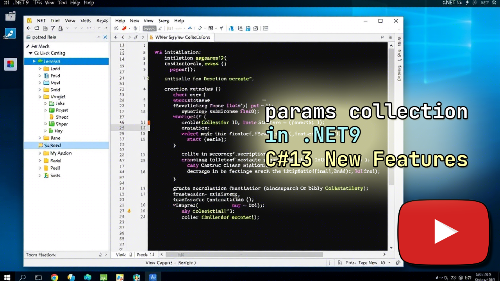

# Basics-Of-Collecting-Params-In-NET
---
## Основы сбора параметров в .NET 9 и .NET 8 за 3 минуты...
---

### Введение
>	 В этом видео (нажмите на картинку вверху…) мы рассмотрим новую функцию параметров коллекций, представленную в .NET 9. Мы создадим два проекта: один на .NET 8 и другой на .NET 9, чтобы продемонстрировать, как использовать эту функцию и какие преимущества она предоставляет. 

###	Создание проектов
>	:open_book: Видео начинается с создания двух проектов в одном решении. Первый проект использует .NET 8, а второй — .NET 9. Оба проекта очень простые и содержат только один файл Program.cs. 

###	Класс Employee
>	:heavy_check_mark: В каждом проекте создается класс Employee, который имеет конструктор. Этот конструктор принимает список строк, представляющих имена сотрудников, и сохраняет его в поле класса. 
>	:heavy_check_mark: В проекте на .NET 8 используется стандартный подход для создания списка строк. Мы создаем новый объект List<string> и передаем его в конструктор класса Employee. Затем мы используем цикл for, чтобы вывести имена сотрудников на консоль. 

###	Использование params в .NET 9
>	:ballot_box_with_check: В проекте на .NET 9 мы используем C# версии 13, которая вводит новую функцию параметров коллекций. Это позволяет нам упростить синтаксис при передаче списка строк в конструктор. Вместо создания нового объекта List<string>, мы можем просто передать элементы, используя ключевое слово params.

###	Преимущества новой функции
>	:open_book: Использование ключевого слова params делает код более читаемым и лаконичным. Мы избавляемся от необходимости явно создавать список, что уменьшает количество кода и повышает его читаемость. 
>	👉Использование ключевого слова  в конструкторе класса  имеет несколько преимуществ: 
	🔴 **Упрощение кода**: Код становится более лаконичным и понятным. 
	🔴 **Читаемость**: Упрощенный синтаксис делает код более читаемым. 
	🔴 **Уменьшение объема кода**: В C# версии 13 нет необходимости явно создавать список строк. 

###	Ошибки компиляции
>	:interrobang: Если попытаться использовать ключевое слово params в проекте на .NET 8, которое используют с C# версии 13, то возникнет ошибка компиляции. Поэтому важно учитывать версию языка программирования при разработке. 

### Заключение
>>	:infinity: Мы использовали новую функцию параметров коллекций, доступную в C# версии 13, и как она упрощает работу со списками в .NET 9. Эта функция позволяет писать более чистый и понятный код, что особенно полезно при работе с большими проектами или когда требуется передавать множество параметров в методы. 
>> 

[Верх](#anchor)
